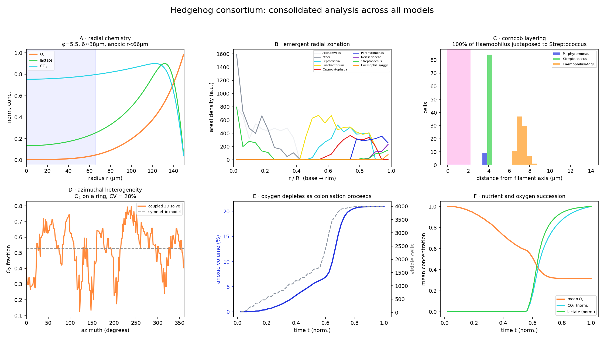
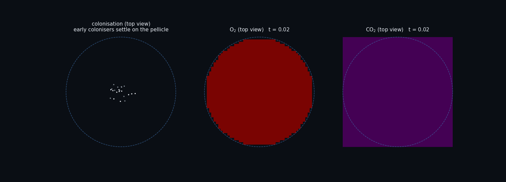
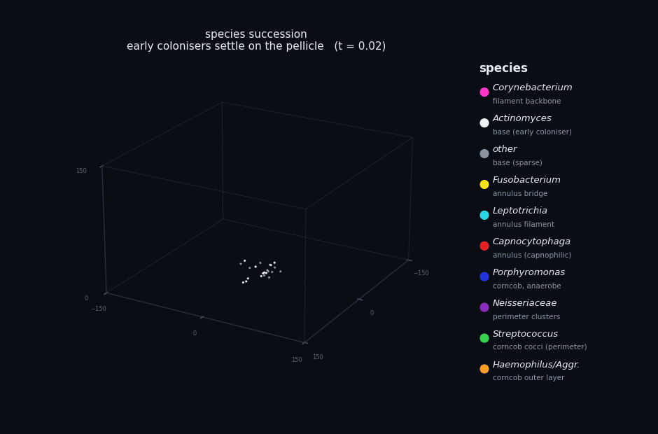
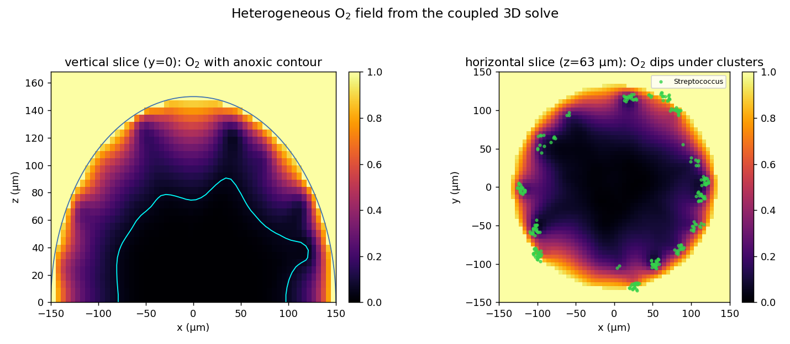

# The hedgehog consortium

A modelling repository that turns the classic two-dimensional schematic of supragingival 
dental plaque into a computational reconstruction. It represents the radial, 
nine-taxon “hedgehog” structure described by Mark Welch and colleagues (PNAS, 2016) 
and grounds the assembly in the coaggregation and cell-to-cell distance framework 
developed by Kolenbrander and colleagues (Nature Reviews Microbiology, 2010).


The source schematic is a wedge cut through a radially symmetric object. This repository contains the
mathematics that explains the zonation, agent based models that recover the structure from local
rules, a time resolved model in which the chemistry evolves as the community colonises, the resulting
animations, a consolidated analysis dashboard, and an interactive three dimensional viewer.

## Contents

```
oral-biofilm-hedgehog/
  README.md
  requirements.txt
  docs/
    ecology_and_spatial_organization.md   analysis: the ecology, the models, the results
  src/
    params.py                  shared taxa, traits, colours, physical parameters
    reaction_diffusion.py      Model A: O2 / lactate / CO2 gradients (the zonation)
    hedgehog_assembly.py       Model B: emergent self assembly of the whole consortium
    corncob_coaggregation.py   Model C: the corncob and the cell to cell distance rule
    field_3d.py                Model D: 3D volumetric O2 / CO2 / lactate fields (radial lift)
    reaction_diffusion_3d.py   Model E: coupled 3D field solved on the biomass (heterogeneous)
    succession_3d.py           Model F: dynamic succession with evolving coupled fields
    analysis.py                consolidated analysis dashboard across all models
    run_all.py                 regenerate every figure and GIF
  figures/                     generated GIFs and analysis plots
  web/
    hedgehog_3d.html           interactive, rotatable 3D viewer (open in a browser)
```

## Gallery

Consolidated analysis across all models:



Dynamic succession with the coupled fields, the species legend and the live anoxic volume readout:


Top down colonisation waves with the oxygen and carbon dioxide maps:



Species succession in 3D with a species names panel:



The coupled 3D oxygen field is not radially symmetric (vertical and horizontal slices):



## The models

**Model A, reaction diffusion (`reaction_diffusion.py`).** The steady chemistry on a radial
coordinate. Oxygen is consumed faster than it diffuses in, so the core goes anoxic and the rim stays
oxic. With order of magnitude biofilm parameters the Thiele modulus is about 5.5, the oxygen
penetration depth is about 38 um, and the anoxic core reaches to about 66 um of a 150 um structure.
Lactate peaks where the streptococci make it; carbon dioxide accumulates across the annulus.
Outputs: `A_o2_gradient.gif`, `A_radial_profiles.png`.

**Model B, emergent assembly (`hedgehog_assembly.py`).** An agent based model with only local rules:
early colonisers form a basal lawn, Corynebacterium filaments grow outward, and every other cell
attaches only next to a partner taxon at a site whose local oxygen, reduced by crowding, suits it. No
cell is told its target radius; the three zone radial structure emerges on its own.
Outputs: `B_assembly.gif`, `B_radial_zonation.png`.

**Model C, the corncob (`corncob_coaggregation.py`).** One filament tip. Streptococcus and
Porphyromonas dock onto the Corynebacterium filament, and Haemophilus docks only onto streptococci. A
concentric layered corncob emerges, and about 99 to 100 percent of the Haemophilus cells end up
juxtaposed to a Streptococcus, confirming the cell to cell distance rule.
Outputs: `C_corncob.gif`, `C_corncob_layering.png`.

**Model D, 3D fields by radial lift (`field_3d.py`).** Lifts the 1D radial solution into a 3D cube
under exact radial symmetry, rendering the hedgehog as a transparent dome. Useful as a clean
reference, but it cannot show azimuthal structure.
Outputs: `D_field_O2_3d.gif`, `D_field_CO2_3d.gif`, `D_field_lactate_3d.gif`, `D_fields_multipanel.gif`.

**Model E, coupled 3D solve (`reaction_diffusion_3d.py`).** Solves the reaction diffusion equations on
the full 3D voxel grid with source and sink terms supplied by discrete heterogeneous biomass. The
field is no longer radially symmetric: oxygen dips beneath dense corncob clusters, the anoxic boundary
is irregular, and the azimuthal coefficient of variation of O2 on a fixed radius ring is around 28
percent, against zero for the symmetric model. The 3D clouds are colour coded by concentration.
Outputs: `E_biomass_3d.gif`, `E_field3d_O2.gif`, `E_field3d_CO2.gif`, `E_field3d_lactate.gif`,
`E_slices.png`, `E_heterogeneity.png`, `E_topview.png`, `E_coupled_multipanel.gif`.

**Model F, dynamic succession (`succession_3d.py`).** The time resolved version. The consortium
colonises in succession waves and at every frame the 3D O2, CO2 and lactate fields are re-solved
against the current biomass, warm started from the previous frame. Oxygen changes dynamically: the
dome begins fully oxygenated and the anoxic core emerges only as the consuming biomass accumulates
(anoxic volume fraction climbs from 0 to about 21 percent over the run). All fields are colour coded.
Outputs (multipanel, single panel GIFs, and analysis):
`F_succession_multipanel.gif`, `F_succession_topview.gif`, `F_succession_species_3d.gif`,
`F_succession_O2_3d.gif`, `F_succession_CO2_3d.gif`, `F_succession_lactate_3d.gif`, `F_dynamics.png`.

## Mathematical formulation

All concentrations are normalised; lengths are in microns and time in seconds.

### Reaction diffusion (Model A, radial and spherically symmetric)

```
dO/dt = D_O * lap(O) - w(r) * Qmax * O / (Km + O)        oxygen, Michaelis-Menten uptake
dL/dt = D_L * lap(L) + s(r) * Lp        - kL * L          lactate, produced then consumed
dC/dt = D_C * lap(C) + s(r) * Cp        - kC * C          carbon dioxide

lap(f) = d2f/dr2 + (2 / r) * df/dr                        spherical radial Laplacian
```

Activity weights place the biology. Respiration is concentrated in the dense peripheral shell and
fermentation just inside the rim:

```
w(r) = 0.25 + 0.75 * exp( - ((r - R) / (0.18 R))^2 )      respiration weight
s(r) =          exp( - ((r - 0.96 R) / (0.10 R))^2 )      fermentation source
```

Boundary conditions:

```
dO/dr = 0   at r = 0           symmetry at the centre
O(R)  = O_sat                  saliva oxygen at the exposed rim
L(R)  = 0                      lactate washed at the rim
```

### Dimensionless groups

```
Thiele modulus      phi   = R * sqrt( Qmax / ( D_O * (Km + O_sat) ) )
penetration depth   delta = sqrt( 2 * D_O * O_sat / Qmax )

phi >> 1   =>   reaction limited   =>   thin oxic rim over a large anoxic core
```

### Coaggregation and the cell to cell distance rule (Models B and C)

A new cell of taxon X may attach at a candidate position p only if a partner taxon already sits within
the contact distance d_c, and only if it does not overlap an existing cell:

```
exists j :  || p - p_j || < d_c   and   taxon(j) in partners(X)         coaggregation
for all j :  || p - p_j || > d_min                                       steric exclusion
```

### Crowding shielded local oxygen (Model B)

The dense corncob shell shields the interior, which is why anaerobes survive at the oxic periphery.
The local oxygen seen by a candidate site is the radial value attenuated by local crowding:

```
O_local(p) = O_radial(r) * exp( - n(p) / n0 )
n(p) = number of existing cells within 6 um of p
```

### Coupled 3D solve (Models E and F)

Discrete biomass is rasterised onto the voxel grid and Gaussian smoothed into two fields: the
respiration weight W_resp from the oxygen consumers (Streptococcus, Haemophilus, Neisseriaceae,
Corynebacterium) and the fermentation weight W_ferm from the producers (Streptococcus). The same three
equations are then solved on the cube with a 7 point Laplacian:

```
dO/dt = D_O * lap3(O) - W_resp * Qmax * O / (Km + O)
dL/dt = D_L * lap3(L) + W_ferm * Lp - kL * L
dC/dt = D_C * lap3(C) + W_ferm * Cp - kC * C

reservoir : O = O_sat, L = 0, C = 0  for all voxels with r > R    saliva bathes the dome
no flux   : dO/dz = 0 at z = 0                                    impermeable enamel at the base
```

### Dynamic succession (Model F)

Each cell carries an appearance time t_app in [0, 1] that encodes the colonisation order:

```
base colonisers       t_app ~ 0.00 .. 0.12
filament point at r   t_app = 0.04 + 0.50 * (r / R)     filaments grow outward
corncob cells         t_app = t_tip + small jitter      after the tip reaches the rim
annulus cells         t_app ~ 0.45 .. 0.80

at colonisation time tf only cells with t_app <= tf are present; the fields are re-solved
against that biomass, warm started from the previous frame, so oxygen evolves dynamically.
```

### Parameters (`params.py`)

```
R    = 150 um              hedgehog radius
D_O2 = 1800 um^2/s         oxygen diffusivity in biofilm (about 0.6 x bulk water)
D_CO2 = 1900 um^2/s        D_LAC = 1000 um^2/s
Qmax = 2.5 (1D) , 6.0 (3D) maximum areal O2 uptake
Km   = 0.05                half saturation for O2 uptake
O_sat = 1.0                normalised saliva oxygen
anoxic threshold = 0.05    O2 fraction below which a region counts as anoxic
d_c  = 1.5 um              coaggregation contact distance (Kolenbrander et al. 2010)
```

## The analysis dashboard

`analysis.py` assembles `analysis_dashboard.png`, one figure with the key quantitative result from
every model: the radial chemistry with Thiele modulus and penetration depth (A), the emergent radial
zonation (B), the concentric corncob layering with the cell to cell distance check (C), the azimuthal
heterogeneity of the coupled 3D field against the symmetric model (D), the oxygen depletion over
colonisation time (E), and the nutrient and oxygen succession (F). It reads the Model F metrics from
`figures/F_metrics.npz`, recomputing them if absent.

## The 3D viewer

`web/hedgehog_3d.html` is a self contained interactive model. Open it in any modern browser. Drag to
orbit, scroll to zoom, right drag to pan. The panel toggles auto rotation, a cutaway cross section,
the oxygen gradient shells and the environment labels. Each taxon in the legend can be isolated.

## Running it

```
pip install -r requirements.txt
cd src
python3 run_all.py          # regenerates every figure and GIF in ../figures
```

Each model can also be run on its own, for example `python3 succession_3d.py`.

## Caveats

These are minimal, didactic models with order of magnitude parameters, not fitted simulations. The
geometry is idealised. In Models E and F the biomass is placed by 3D heuristics and a succession
schedule rather than emerging from the full coaggregation agent based model of Model B, so the
assembly order is imposed while the field response is genuinely solved. The field in Model F is
treated quasi statically (re-equilibrated each growth step), valid because diffusion is fast relative
to colonisation. See the analysis document for the fuller discussion.

## Sources

1. Mark Welch JL, Rossetti BJ, Rieken CW, Dewhirst FE, Borisy GG. Biogeography of a human oral
   microbiome at the micron scale. PNAS 2016;113(6):E791 to E800. PMID 26811460.
2. Kolenbrander PE, Palmer RJ Jr, Periasamy S, Jakubovics NS. Oral multispecies biofilm development
   and the key role of cell to cell distance. Nat Rev Microbiol 2010;8:471 to 480. PMID 20514044.
